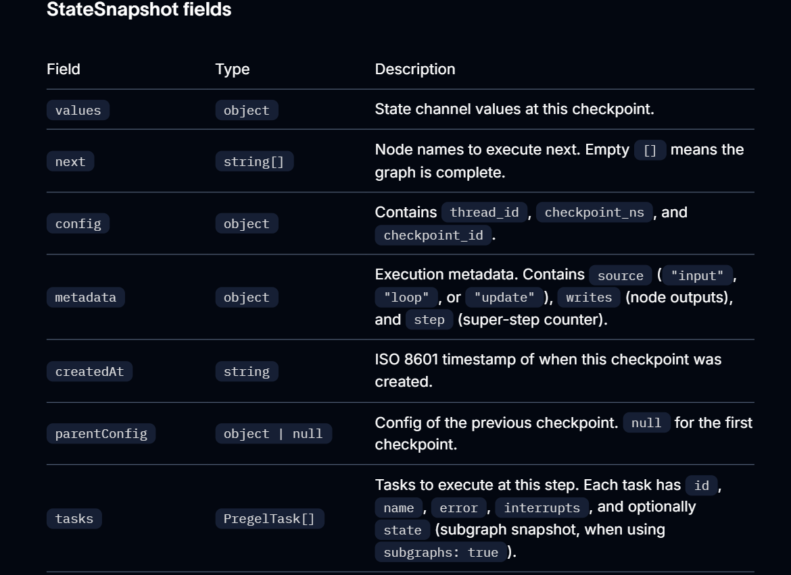

# Checkpointers

A checkpointer saves a snapshot of graph state at each super-step, organized into threads. Compile a graph with a checkpointer to enable human-in-the-loop workflows, time travel debugging, fault-tolerant execution, and conversational memory.


## Why use checkpointers

Checkpointers are required for the following features:

1. Human-in-the-loop: Checkpointers facilitate human-in-the-loop workflows by allowing humans to inspect, interrupt, and approve graph steps.Checkpointers are needed for these workflows as the person has to be able to view the state of a graph at any point in time, and the graph has to be able to resume execution after the person has made any updates to the state. See `Interrupts` for examples.

2. Memory: Checkpointers allow for “memory” between interactions. In the case of repeated human interactions (like conversations) any follow up messages can be sent to that thread, which will retain its memory of previous ones. Useful for adding and managing conversation history

3. Time Travel: Checkpointers allow for “time travel”, allowing users to replay prior graph executions to review and / or debug specific graph steps. In addition, checkpointers make it possible to fork the graph state at arbitrary checkpoints to explore alternative trajectories.

4. Fault Tolerance: Checkpointing provides fault-tolerance and error recovery: if one or more nodes fail at a given superstep, you can restart your graph from the last successful step.

5. Pending writes: When a graph node fails mid-execution at a given super-step, LangGraph stores pending checkpoint writes from any other nodes that completed successfully at that super-step. When you resume graph execution from that super-step you don’t re-run the successful nodes.

## Core concepts

### Threads

A thread is a unique ID or thread identifier assigned to each checkpoint saved by a checkpointer. It contains the accumulated state of a sequence of runs. When a run is executed, the state of the underlying graph of the assistant will be persisted to the thread.

When invoking a graph with a checkpointer, you must specify a thread_id as part of the configurable portion of the config:

```js
{
  configurable: {
    thread_id: "1";
  }
}
```

A thread’s current and historical state can be retrieved. To persist state, a thread must be created prior to executing a run.

The checkpointer uses thread_id as the primary key for storing and retrieving checkpoints. **Without it, the checkpointer cannot save state or resume execution after an interrupt**, since **the checkpointer uses thread_id to load the saved state**.

### Checkpoints

The state of a thread at a particular point in time is called a checkpoint. A checkpoint is a snapshot of the graph state saved at each super-step and is represented by a StateSnapshot object.

### Super Steps

LangGraph creates a checkpoint at each super-step boundary. A super-step is a single “tick” of the graph where all nodes scheduled for that step execute (potentially in parallel).

For a sequential graph like START -> A -> B -> END, there are separate super-steps for the input, node A, and node B — producing a checkpoint after each one. Whereas for a parallel graph (like if START connects to both A and B, they shall share the same checkpoint).

Understanding super-step boundaries is important for time travel, because you can only resume execution from a checkpoint (i.e., a super-step boundary).

In addition to super-step checkpoints, LangGraph also persists writes at the node (task) level. As each node within a super-step finishes, its outputs are written to the checkpointer’s checkpoint_writes table as task entries linked to the in-progress checkpoint. These per-task writes are what enable pending writes recovery: **if another node in the same super-step fails, the successful nodes’ writes are already durable and don’t need to be re-run on resume**. The full state snapshot is then committed once the super-step completes.

Checkpoints are persisted and can be used to restore the state of a thread at a later time.
Let’s see what checkpoints are saved when a simple graph is invoked as follows:

```js
import { StateGraph, StateSchema, ReducedValue, START, END, MemorySaver } from "@langchain/langgraph";
import { z } from "zod/v4";

const State = new StateSchema({
  foo: z.string(),
  bar: new ReducedValue(
    z.array(z.string()).default(() => []),
    { 
      inputSchema: z.array(z.string()),
      reducer: (x, y) => x.concat(y),
    }
  )
});

const workflow = new StateGraph(State)
  .addNode('nodeA', (state) => {
    return { foo: 'a', bar: ['a'] };
  }).addNode('nodeB', (state) => {
    return { foo: 'b', bar: ['b'] };
  }).addEdge(START, 'nodeA')
  .addEdge('nodeA', 'nodeB')
  .addEdge('nodeA', END);

const checkpointer = new MemorySaver();
const graph = workflow.compile({ checkpointer });

const config = { configurable: { thread_id: "1" } };
await graph.invoke({ foo: "", bar: [] }, config);
```

After the run of the graph, we will see exactly 4 checkpoints:

1. Empty checkpoint with START as the next node to be executed
2. Checkpoint with the user input `{'foo': '', 'bar': []}` and `nodeA` as the next node to be executed
3. Checkpoint with the outputs of `nodeA` `{'foo': 'a', 'bar': ['a']}` and `nodeB` as the next node to be executed
4. Checkpoint with the outputs of `nodeB` `{'foo': 'b', 'bar': ['a', 'b']}` and no next nodes to be executed

(Note that the bar channel values contain outputs from both nodes because this example has a reducer for the bar channel.)

### Checkpoint namespace

Each checkpoint has a `checkpoint_ns` (checkpoint namespace) field that identifies which graph or subgraph it belongs to:

1. `""` (empty string): The checkpoint belongs to the parent (root) graph.
2. `"node_name:uuid"`:  The checkpoint belongs to a subgraph invoked as the given node. For nested subgraphs, namespaces are joined with `|` separators (e.g., `"outer_node:uuid|inner_node:uuid"`)

You can access the checkpoint namespace from within a node via the config:

```js
const node = async (state, config) => {
  const checkpointNamespace = config.configurable?.checkpoint_ns
  // "" for parent graph, "node_name:uuid" for a subgraph
}
```

See Subgraphs for more details on working with subgraph state and checkpoints.

## Get and Update State

### Get State

When interacting with the saved graph state, you must specify a thread identifier. You can view the latest state of the graph by calling `graph.getState(config)`. This will return a `StateSnapshot` object that corresponds to the **latest checkpoint** associated with the thread ID provided in the config or a checkpoint associated with a checkpoint ID for the thread, if provided.

```js
// get the "latest" state snapshot
const config = { configurable: { thread_id: "1" } };
await graph.getState(config);

// get a state snapshot for a specific checkpoint_id
const config = {
  configurable: {
    thread_id: "1",
    checkpoint_id: "1ef663ba-28fe-6528-8002-5a559208592c",
  },
};

await graph.getState(config);
```

Example output for out graph used previously:

```js
StateSnapshot {
  values: { foo: 'b', bar: ['a', 'b'] },
  next: [],
  config: {
    configurable: {
      thread_id: '1',
      checkpoint_ns: '',
      checkpoint_id: '1ef663ba-28fe-6528-8002-5a559208592c'
    }
  },
  metadata: {
    source: 'loop',
    writes: { nodeB: { foo: 'b', bar: ['b'] } },
    step: 2
  },
  createdAt: '2024-08-29T19:19:38.821749+00:00',
  parentConfig: {
    configurable: {
      thread_id: '1',
      checkpoint_ns: '',
      checkpoint_id: '1ef663ba-28f9-6ec4-8001-31981c2c39f8'
    }
  },
  tasks: []
}
```

StateSnapshot fields:


### Get state history

You can get the full history of the graph execution for a given thread by calling `graph.getStateHistory(config)`. This will return a list of StateSnapshot objects associated with the thread ID provided in the config. **Importantly, the checkpoints will be ordered chronologically with the most recent checkpoint / StateSnapshot being the first in the list.**

```js
const config = { configurable: { thread_id: "1" } };
for await (const state of graph.getStateHistory(config)) {
  console.log(state);
}
```


### Find state checkpoint

You can filter the state history to find checkpoints matching specific criteria:

```js
const history: StateSnapshot[] = [];
for await (const state of graph.getStateHistory(config)) {
  history.push(state);
}

// Find the checkpoint before a specific node executed
const beforeNodeB = history.find((s) => s.next.includes("nodeB"));

// Find a checkpoint by step number
const step2 = history.find((s) => s.metadata.step === 2);

// Find checkpoints created by updateState
const forks = history.filter((s) => s.metadata.source === "update");

// Find the checkpoint where an interrupt occurred
const interrupted = history.find(
  (s) => s.tasks.length > 0 && s.tasks.some((t) => t.interrupts.length > 0)
);
```

### Replay

Replay re-executes steps from a prior checkpoint. Invoke the graph with a prior checkpoint_id to re-run nodes after that checkpoint. Nodes before the checkpoint are skipped (their results are already saved). Nodes after the checkpoint re-execute, including any LLM calls, API requests, or interrupts — which are always re-triggered during replay.

See Time travel for full details and code examples on replaying past executions.


### Update State

You can edit the graph state using `graph.updateState()`. This creates a new checkpoint with the updated values — it does not modify the original checkpoint. The update is treated the same as a node update: values are passed through reducer functions when defined, so channels with reducers accumulate values rather than overwrite them.

You can optionally specify `asNode` to control which node the update is treated as coming from, which affects which node executes next. See Time travel: `asNode` for details.


## Durability Modes

LangGraph supports three durability modes for the way it persists checkpoint data, that let you balance performance and data consistency. You can specify the durability mode when calling any graph execution method:

```js
await graph.stream(
  { input: "test" },
  { durability: "sync" }
)
```

The durability modes, from least to most durable, are as follows:

1. `exit`: LangGraph persists changes only when graph execution exits — successfully, with an error, or due to a human-in-the-loop interrupt. This provides the best performance for long-running graphs but means intermediate state is not saved, so you cannot recover from system failures (like process crashes) mid-execution.

2. `async`: LangGraph persists changes asynchronously while the next step executes. This provides good performance and durability, but there is a small risk that LangGraph does not write checkpoints if the process crashes during execution.

3. `sync`: LangGraph persists changes synchronously before the next step starts. This ensures that LangGraph writes every checkpoint before continuing execution, providing high durability at the cost of some performance overhead.

## Build a custom checkpointer
