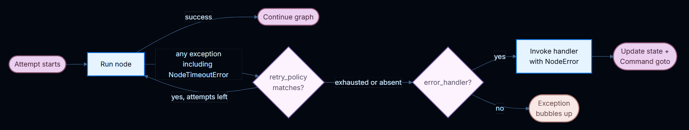
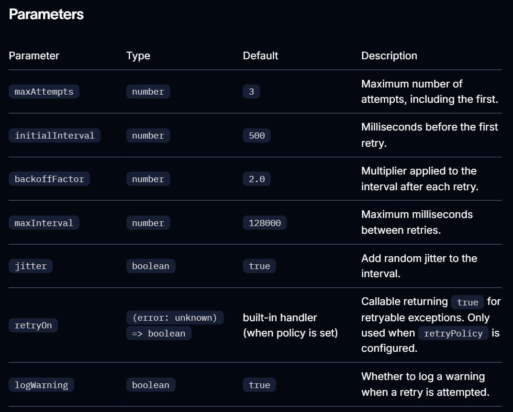
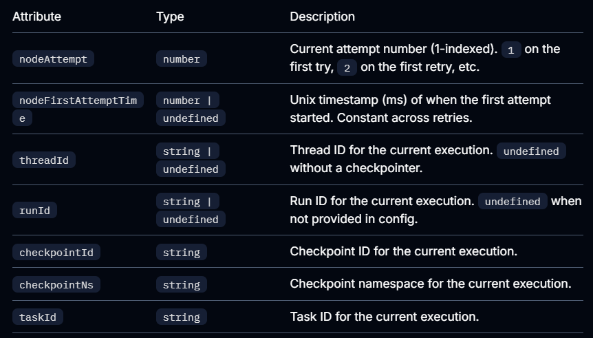
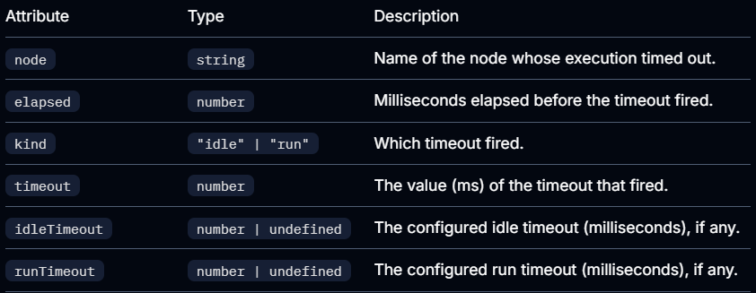

# Fault Tolerance

When a node fails—from a slow external API, a transient network error, or an unhandled exception—LangGraph gives you three composable mechanisms to respond:

1. Retries - automatically re-run failed attempts based on exception type and backoff settings
2. Timeouts — cap how long a single attempt may run
3. Error handling — run a recovery function after all retries are exhausted

Use `setNodeDefaults` to configure these mechanisms once **for all nodes** instead of repeating them on every `addNode` call.

For stopping a run cleanly at a superstep boundary and resuming later, see Graceful shutdown.



## Retries

A retry policy automatically re-runs a failed node attempt based on exception type and backoff settings.

Pass `retryPolicy` to `addNode`:

```js
import { StateGraph } from "@langchain/langgraph";

const graph = new StateGraph(State)
  .addNode("callApi", callApi, { retryPolicy: { maxAttempts: 3 } })
  .compile();
```

### Default behavior

Retries are opt-in. A node retries only when it has a retryPolicy configured, either directly or through graph defaults with `setNodeDefaults`. An empty policy ({}) is enough. Without a policy, the first failure ends the attempt and LangGraph does not call retryOn.

If the policy omits retryOn, LangGraph uses a built-in handler that retries thrown errors except:

- Abort and cancellation errors: `error.name === "AbortError"`, or `error.message` starts with `"Cancel"` or `"AbortError"`
- `GraphValueError`, matched by `error.name`
- Aborted connections: `error.code === "ECONNABORTED"`
- HTTP client errors with status `400`, `401`, `402`, `403`, `404`, `405`, `406`, `407`, or `409`, read from `error.response?.status` or `error.statu`s for clients such as `fetch`, `Axios`, and similar clients
- OpenAI-style quota errors: `error.error?.code === "insufficient_quota"`

Other HTTP statuses, including `408` and 5xx responses, are retryable unless you override `retryOn`. `NodeTimeoutError` is not on this blocklist, so it is retryable when a retry policy is configured.

Some failures bypass retryOn. Graph control-flow errors, such as GraphInterrupt and Command routing, bubble up without retrying. An aborted run signal also stops the retry loop, even if retryOn would return true.

Parameters


### Custom retry logic

Pass a callback to `retryOn` - implement your own predicate:

```js
import { StateGraph } from "@langchain/langgraph";

class MyCustomError extends Error {}

const graph = new StateGraph()
  // we are calling with a no-op function
  .addNode("callApi", () => ({}), {
    retryPolicy: {
      maxAttempts: 3
      retryOn: (error: unknown): boolean => {
        if (error instanceof MyCustomError) return false;
        // Retry on other errors
        return true;
      },
    },
  }).compile()
```

### inspect retry state

Use execution info inside a node to inspect the current attempt number. This is useful for switching to a fallback when the primary call keeps failing:

```js
import { StateGraph, StateSchema, START, END, type Runtime } from "@langchain/langgraph";
import * as z from "zod";

const State = new StateSchema({
  result: z.string(),
});

const myNode = async (state: typof State.State, runtime: Runtime<typeof State>) => {
  if ((runtime.executionInfo?.nodeAttempt ?? 1) > 2) {
    return { result: await callFallbackApi() };
  }
  return { result: await callPrimaryApi() };
}

const graph = new StateGraph(State)
  .addNode("myNode", myNode, { retryPolicy: { maxAttempts: 3 } })
  .addEdge(START, "myNode")
  .addEdge("myNode", END)
  .compile();
```

`executionInfo` exposes the following fields:



## Timeouts

The `timeout` parameter on `addNode` caps how long a single node attempt may run. Pass a number (milliseconds) or a `TimeoutPolicy` for separate run and idle limits:

```js
import { StateGraph, type TimeoutPolicy } from "@langchain/langgraph";

// Simple wall-clock cap (60 seconds)
new StateGraph(State).addNode("callModel", callModel, { timeout: 60_000 });

// Separate run and idle limits
new StateGraph(State).addNode("callModel", callModel, {
  timeout: { runTimeout: 120_000, idleTimeout: 30_000 },
});
```

### Run timeouts

`runTimeout` is a hard wall-clock cap on a single attempt. It is never refreshed, regardless of node activity:

```js
const graph = new StateGraph(State)
  .addNode("callModel", callModel, {
    timeout: { runTimeout: 120_000 },
  })
  .compile();
```

When the limit is exceeded, LangGraph raises `NodeTimeoutError`, clears any writes from the failed attempt, and lets the retry policy decide whether to retry.

### Idle timeouts

`idleTimeout` is a progress-resetting cap. It fires only when the node stops making observable progress for the specified duration—unlike `runTimeout`, the clock resets whenever the node produces a progress signal:

```js
const graph = new StateGraph(State)
  .addNode("callModel", callModel, {
    timeout: { idleTimeout: 30_000 },
  })
  .compile();
```

You can set `runTimeout` and `idleTimeout` together. Whichever fires first cancels the attempt.

### Progress Signals for idle timeouts

Under the default refreshOn: "auto", the idle clock resets on any of the following:

- State writes through the graph write path
- Custom stream output via `runtime.writer`
- Child-task scheduling
- Any LangChain callback event from the node or its descendants (LLM tokens, tool calls, chain start/end, etc.)

### heartbeat mode for idle timeouts

Set `refreshOn: "heartbeat"` to narrow the refresh source to explicit `runtime.heartbeat()` calls ONLY.
This is useful when you want a strict idle definition that isn’t reset by chatty subordinates:

```js
const graph = new StateGraph(State)
  .addNode("callModel", callModel, {
    timeout: { idleTimeout: 30_000, refreshOn: "heartbeat" },
  })
  .compile();
```

### Manual heartbeats

For long-running work that doesn’t naturally emit progress signals, call runtime.heartbeat() to manually reset the idle clock:

```js
import {
  StateGraph,
  StateSchema,
  START,
  END,
  type Runtime,
} from "@langchain/langgraph";
import * as z from "zod";

const State = new StateSchema({
  result: z.string(),
});

const longRunningNode = async (
  state: typeof State.State,
  runtime: Runtime<typeof State>
) => {
  for (const batch of fetchBatches()) {
    process(batch);
    runtime.heartbeat?.();
  }
  return { result: "done" };
};

const graph = new StateGraph(State)
  .addNode("longRunningNode", longRunningNode, {
    timeout: { idleTimeout: 30_000, refreshOn: "heartbeat" },
  })
  .addEdge(START, "longRunningNode")
  .addEdge("longRunningNode", END)
  .compile();
```

`runtime.heartbeat()` is a no-op outside an idle-timed attempt, so you can call it unconditionally.

### NodeTimeoutError

When a timeout fires, LangGraph raises NodeTimeoutError with structured context about which limit was hit:



Use `isNodeTimeoutError(error)` to narrow caught errors in TypeScript.

`NodeTimeoutError` is retryable by default. Combining `timeout` with a retry policy works out of the box—the timeout clock resets on each new attempt, and writes from a timed-out attempt are cleared before the next retry:

```js
const graph = new StateGraph(State)
  .addNode("callModel", callModel, {
    timeout: { idleTimeout: 30_000 },
    retryPolicy: { maxAttempts: 3 },
  })
  .compile();
```

### Dynamic timeouts with `Send`

When using `Send` to dispatch nodes dynamically (for example, in map-reduce patterns, for calling multiple nodes in parallel, without having to edge them all, or calling a same node multiple times with different state), you can pass a timeout directly on the Send to override the target node’s static timeout for that specific push.

The `Send` class is used within a `StateGraph`'s conditional edges to dynamically invoke a node with a custom state at the next step. Importantly, the sent state can differ from the core graph's state, allowing for flexible and dynamic workflow management.

```js
import { Annotation, Send, StateGraph } from "@langchain/langgraph";

const ChainState = Annotation.Root({
  subjects: Annotation<string[]>,
  jokes: Annotation<string[]>({
    reducer: (a, b) => a.concat(b),
  }),
});

const continueToJokes = async (state: typeof ChainState.State) => {
  return state.subjects.map((subject) => {
    // call "generate_joke" node with different subject, and an idleTimeout of 15s
    return new Send("generate_joke", { subjects: [subject] }, { timeout: { idleTimeout: 15_000 } });
  });
};
```

**If the timeout is omitted on the `Send`, the target node’s timeout (set at `addNode` time) applies. This lets you set a default timeout on the node and tighten it for individual calls.**

## Error Handling

**An error handler runs after a node fails and all retries are exhausted.** It receives the current state and can update it or route to a different node using Command. This is useful for compensation flows (Saga patterns) where you want to recover gracefully rather than abort the entire graph.

Pass `errorHandler` to `addNode` on `StateGraph` only (not the base `Graph` class):

```js
import {
  StateGraph,
  StateSchema,
  START,
  Command,
  NodeError,
} from "@langchain/langgraph";
import * as z from "zod";

class ConnectionError extends Error {}

const State = new StateSchema({
  status: z.string(),
});

//  assume a node that throws error
const chargePayment = () => {
  throw new ConnectionError("payment gateway timeout");
};

// a no-op node to jump to in case of an error
const finalize = (state: typeof State.State) => state;

// lets create an error handler for the node
const paymentErrorHandler = (
  state: typeof State.State,
  error: NodeError
) =>
  // return a new command to go to finallize node
  new Command({
    update: { status: `compensated: ${error.error.message}` },
    goto: "finalize",
  });

const graph = new StateGraph(State)
  .addNode("chargePayment", chargePayment, {
    retryPolicy: {
      maxAttempts: 3,
      retryOn: (err) => err instanceof ConnectionError,
    },
    errorHandler: paymentErrorHandler,
  })
  .addNode("finalize", finalize)
  .addEdge(START, "chargePayment")
  .compile();
```

**The handler fires only after the retry policy is exhausted, or immediately if no retry policy is configured.**  The retry policy and the error handler stay **decoupled**: **configure when to retry and when to compensate independently**.

### NodeError

Error handlers receive failure context through a typed error: `NodeError` parameter:

```js
import { Command, NodeError } from "@langchain/langgraph";

const myHandler = (state: typeof State.State, error: NodeError) => {
  console.log(`Node ${error.node} failed with: ${error.error.message}`);
  return new Command({
    update: { status: "recovered" },
    goto: "nextStep",
  });
};
```

`NodeError` has 2 fields:

- `node`: Name of the node whose execution failed.
- `error`: The exception thrown by the failed node.

### Route with Command

Error handlers can return a Command to update state and route to a specific node, enabling Saga / compensation patterns:

```js
import {
  StateGraph,
  StateSchema,
  START,
  Command,
  NodeError,
} from "@langchain/langgraph";
import * as z from "zod";

class ConnectionError extends Error {}

const State = new StateSchema({
  status: z.string(),
});

const reserveInventory = () => ({ status: "reserved" });

const chargePayment = () => {
  throw new Error("payment timeout");
};

const paymentErrorHandler = (
  state: typeof State.State,
  error: NodeError
) =>
  new Command({
    update: {
      status: `compensated_after_${error.node}: ${error.error.message}`,
    },
    goto: "finalize",
  });

const finalize = (state: typeof State.State) => state;

const graph = new StateGraph(State)
  .addNode("reserveInventory", reserveInventory)
  .addNode("chargePayment", chargePayment, {
    retryPolicy: {
      maxAttempts: 3,
      retryOn: (err) => err instanceof ConnectionError,
    },
    errorHandler: paymentErrorHandler,
  })
  .addNode("finalize", finalize)
  .addEdge(START, "reserveInventory")
  .addEdge("reserveInventory", "chargePayment")
  .compile();
```

`chargePayment` retries on `ConnectionError` up to 3 times. If retries are exhausted (or the error isn’t a `ConnectionError`), the handler compensates by updating state and routing to finalize instead of aborting the graph.

### Interrupts

`interrupt()` raised inside a node is not routed to the error handler. Interrupts use the `GraphBubbleUp` mechanism to pause graph execution for human-in-the-loop workflows, bypassing both retry policies and error handlers. The graph pauses as usual.

### Subgraph failures

If a node wraps a subgraph and the subgraph raises an unhandled exception, that exception surfaces to the parent node. If the parent node has an error handler, the handler fires with the subgraph’s exception in `error.error`.

## Graph defaults

Instead of repeating the same retryPolicy, errorHandler, timeout, or cachePolicy on every addNode call, use setNodeDefaults to configure graph-wide defaults in one place:

```js
import { StateGraph, START, NodeError } from "@langchain/langgraph";

const defaultErrorHandler = (
  state: typeof State.State,
  error: NodeError
) => ({ status: `handled: ${error.error.message}` });

const graph = new StateGraph(State)
  .setNodeDefaults({
    retryPolicy: { maxAttempts: 3 },
    errorHandler: defaultErrorHandler,
    timeout: { runTimeout: 30_000 },
    cachePolicy: { ttl: 60 },
  })
  .addNode("stepA", stepA)
  .addNode("stepB", stepB)
  .addEdge(START, "stepA")
  .compile();
```

Both stepA and stepB now share the same retry policy, error handler, timeout, and cache policy without any duplication.

### Precedence

Per-node values passed directly to `addNode()` always override defaults set by `setNodeDefaults()`. Defaults are resolved at `compile()` time, so you can call `setNodeDefaults()` before or after `addNode()` in any order:

```js
import { StateGraph, START } from "@langchain/langgraph";

const graph = new StateGraph(State)
  .setNodeDefaults({ errorHandler: defaultErrorHandler })
  .addNode("stepA", stepA) // uses defaultErrorHandler
  .addNode("stepB", stepB, { errorHandler: customErrorHandler }) // overrides defaultErrorHandler
  .addEdge(START, "stepA")
  .compile();
```

## Graceful Shutdown

Cooperative shutdown lets you stop an in-flight graph run after the current superstep completes and save a resumable checkpoint. This is useful for handling SIGTERM signals or any external supervisor that needs to reclaim resources without losing work.

Create a `RunControl` and pass it as `control` to `invoke` or `stream`. Call `requestDrain()` from any context to signal that the run should stop:

```js
import { RunControl, GraphDrained } from "@langchain/langgraph";

const control = new RunControl();

// In a signal handler or supervisor:
// control.requestDrain("sigterm");

// inside a graph invocation

try {
  const result = await graph.invoke(inputs, { ...config, control });
} catch (e) {
  if (e instanceof GraphDrained) {
    // The graph stopped early and saved a checkpoint.
    // Resume later with the same config.
    console.log(`Drained: ${e.reason}`);
  } else {
    throw e;
  }
}
```

### Resume after drain

Resume a drained run with `invoke(null, config)` using the same `thread_id`:

```js
const result = await graph.invoke(null, config);
```

### Read drain state inside a node

Access drain state through the `runtime` parameter to adjust node behavior before the superstep boundary is reached:

```js
import { type Runtime } from "@langchain/langgraph";

const myNode = async (state: typeof State.State, runtime: Runtime<typeof State>) => {
  if (runtime.control?.drainRequested) {
    // Skip expensive work and return a minimal result
    return { status: "skipped", reason: runtime.control.drainReason };
  }
  return { status: await doWork() };
};
```

### SIGTERM hook pattern

The recommended pattern for handling process shutdown:

```js
import process from "node:process";
import { RunControl, GraphDrained } from "@langchain/langgraph";

const control = new RunControl();
process.on("SIGTERM", () => control.requestDrain("sigterm"));

// pass the control to the graph runtime
try {
  const result = await graph.invoke(inputs, { ...config, control });
} catch (e) {
  if (e instanceof GraphDrained) {
    console.log(`graph drained: ${e.reason}`);
    // Resume on next startup with the same config
  } else {
    throw e;
  }
}
```

`requestDrain()` does not cancel in-flight `async` work. For a hard upper bound, pair drain with a graceful timeout and an `AbortSignal`.
