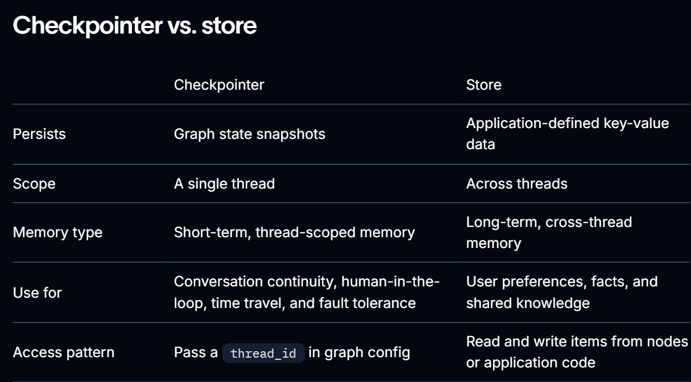

# Persistence

Persistence lets LangGraph applications keep useful information beyond a single graph run. It matters when an agent needs to continue a conversation, resume after an interruption, recover from a failure, or remember information across interactions.

LangGraph provides two complementary persistence systems:

1. **Checkpointers**: Checkpointers persist a thread’s graph state as checkpoints. Use them for short-term, thread-scoped memory, including conversation continuity, human-in-the-loop workflows, time travel, and fault tolerance.

2. **Stores**: Stores persist application-defined data outside the graph state. Use them for long-term, cross-thread memory, including user preferences, facts, and shared knowledge.

Most applications can use both: **a checkpointer tracks the current thread**, and **a store tracks durable information across threads**.

## Example:

```js
import { MemorySaver, MemoryStore } from '@langchain/langgraph'

const checkpointer = new MemorySaver();
const stoore = new MemoryStore();

const graph = new StateGraph().compile({ checkpointer, store });

const result = await graph.invoke(
  { messages: new HumanMessage("Hi, my name is Bob.") },
  { configurable: { thread_id: 'thread-1' } }
);
```

