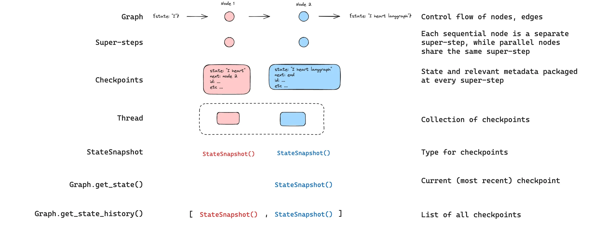
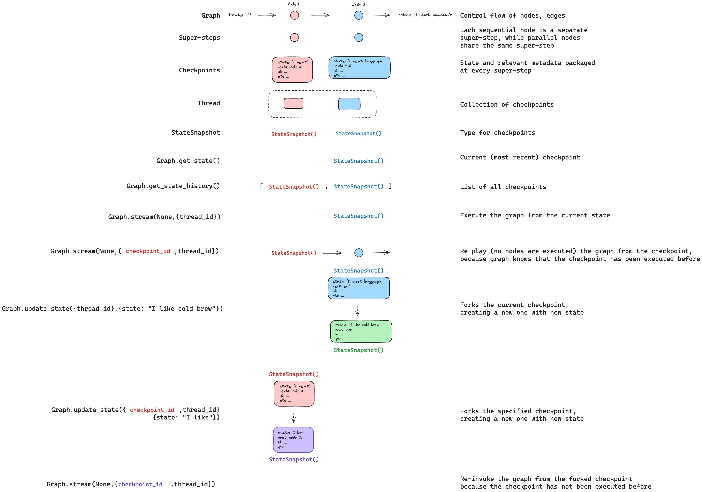

# Persistence

LangGraph has a built-in persistence layer that saves graph state as checkpoints. When you compile a graph with a checkpointer, a snapshot of the graph state is saved at every step of execution, organized into threads. **This enables human-in-the-loop workflows, conversational memory, time travel debugging, and fault-tolerant execution.**


## Why use persistence: 
- **Human-in-the-loop**: Checkpointers facilitate human-in-the-loop workflows by allowing humans to inspect, interrupt, and approve graph steps. Checkpointers are needed for these workflows as the person has to be able to view the state of a graph at any point in time, and the graph has to be able to resume execution after the person has made any updates to the state. 
- **Memory**: Checkpointers allow for “memory” between interactions. In the case of repeated human interactions (like conversations) any follow up messages can be sent to that thread, which will retain its memory of previous ones.
- **Time travel**: Checkpointers allow for “time travel”, allowing users to replay prior graph executions to review and / or debug specific graph steps. In addition, checkpointers make it possible to fork the graph state at arbitrary checkpoints to explore alternative trajectories.
- **Fault-tolerance**: Checkpointing provides fault-tolerance and error recovery: if one or more nodes fail at a given superstep, you can restart your graph from the last successful step.
- **Pending writes**: When a graph node fails mid-execution at a given super-step, LangGraph stores pending checkpoint writes from any other nodes that completed successfully at that super-step. When you resume graph execution from that super-step you don’t re-run the successful nodes.

## Core concepts

## 1. Threads
A thread is a unique ID or thread identifier assigned to each checkpoint saved by a checkpointer. It contains the accumulated state of a sequence of runs. When a run is executed, the state of the underlying graph of the assistant will be persisted to the thread.

When invoking a graph with a checkpointer, you **must** specify a thread_id as part of the configurable portion of the config:
```js
{
  configurable: {
    thread_id: "1";
  }
}
```

A thread’s current and historical state can be retrieved. To persist state, a thread must be created prior to executing a run.
**The checkpointer uses thread_id as the primary key for storing and retrieving checkpoints. Without it, the checkpointer cannot save state or resume execution after an interrupt, since the checkpointer uses thread_id to load the saved state.**

## 2. Checkpoints (Short term memory)
The state of a thread at a particular point in time is called a checkpoint. A checkpoint is a snapshot of the graph state saved at each **super-step** and is represented by a `StateSnapshot` object.

**Super-steps**: LangGraph creates a checkpoint at each super-step boundary. A super-step is a single “tick” of the graph where all nodes scheduled for that step execute (potentially in parallel).
 For a sequential graph like `START -> A -> B -> END`, there are separate super-steps for the input, `node A`, and `node B` — producing a checkpoint after each one. Understanding super-step boundaries is important for time travel, because you can only resume execution from a checkpoint (i.e., a super-step boundary).

 In addition to super-step checkpoints, LangGraph also persists writes at the **node (task)** level. As each node within a super-step finishes, its outputs are written to the checkpointer’s checkpoint_writes table as task entries linked to the in-progress checkpoint. These per-task writes are what enable pending writes recovery: if another node in the same super-step fails, the successful nodes’ writes are already durable and don’t need to be re-run on resume. The full state snapshot is then committed once the super-step completes.

 Lets look at an example for checkpoints:
 ```js
import { StateGraph, Annotation, START, END, MemorySaver } from "@langchain/langgraph";
import { z } from "zod/v4";

const GraphState = Annotation.root({
    foo: Annotation<string>,
    bar: Annotation<string[]>({
        default: () => [],
        reducer: (current, next) => current.concat(next),
    })
});

const workflow = new StateGraph(State)
  .addNode("nodeA", (state) => {
    return { foo: "a", bar: ["a"] };
  })
  .addNode("nodeB", (state) => {
    return { foo: "b", bar: ["b"] };
  })
  .addEdge(START, "nodeA")
  .addEdge("nodeA", "nodeB")
  .addEdge("nodeB", END);

const checkpointer = new MemorySaver();
const graph = workflow.compile({ checkpointer });

const config = { configurable: { thread_id: "1" } };
await graph.invoke({ foo: "", bar: [] }, config);
```

After we run the graph, we expect to see exactly 4 checkpoints:
- Empty checkpoint with `START` as the next node to be executed
- Checkpoint with the user input `{'foo': '', 'bar': []}` and `nodeA` as the next node to be executed
- Checkpoint with the outputs of `nodeA` `{'foo': 'a', 'bar': ['a']}` and `nodeB` as the next node to be executed
- Checkpoint with the outputs of `nodeB` `{'foo': 'b', 'bar': ['a', 'b']}` and no next nodes to be executed

*Note that the bar channel values contain outputs from both nodes as we have a reducer for the bar channel.*

### Checkpoint Namespace:
Each checkpoint has a checkpoint_ns (checkpoint namespace) field that identifies which graph or subgraph it belongs to:
- `""` (empty string): The checkpoint belongs to the parent (root) graph.
- `"node_name:uuid"`: The checkpoint belongs to a subgraph invoked as the given node. For nested subgraphs, namespaces are joined with `|` separators (e.g., `"outer_node:uuid|inner_node:uuid"`).

Example:
```js
import { RunnableConfig } from "@langchain/core/runnables";

function myNode(state: typeof State.Type, config: RunnableConfig) {
  const checkpointNs = config.configurable?.checkpoint_ns;
  // "" for the parent graph, "node_name:uuid" for a subgraph
}
```

## Getting and Updating state

### 1. Get state
When interacting with the saved graph state, you must specify a thread identifier. You can view the latest state of the graph by calling `graph.getState(config)`. This will return a `StateSnapshot` object that corresponds to the latest checkpoint associated with the thread ID provided in the config or a checkpoint associated with a checkpoint ID for the thread, if provided.

```js
// get the latest state snapshot
const config = { configurable: { thread_id: "1" } };
await graph.getState(config);

// get a state snapshot for a specific checkpoint_id
const config = {
  configurable: {
    thread_id: "1",
    checkpoint_id: "1ef663ba-28fe-6528-8002-5a559208592c",
  },
};
await graph.getState(config);
```

In our example, the output of getState will look like this:
```js
StateSnapshot {
  values: { foo: 'b', bar: ['a', 'b'] },
  next: [],
  config: {
    configurable: {
      thread_id: '1',
      checkpoint_ns: '',
      checkpoint_id: '1ef663ba-28fe-6528-8002-5a559208592c'
    }
  },
  metadata: {
    source: 'loop',
    writes: { nodeB: { foo: 'b', bar: ['b'] } },
    step: 2
  },
  createdAt: '2024-08-29T19:19:38.821749+00:00',
  parentConfig: {
    configurable: {
      thread_id: '1',
      checkpoint_ns: '',
      checkpoint_id: '1ef663ba-28f9-6ec4-8001-31981c2c39f8'
    }
  },
  tasks: []
}
```

StateSnapshot object fields:
- `values` - `object`: State channel values at this checkpoint.
- `next` - `string[]`: Node names to execute next. Empty `[]` means the graph is complete.
- `config` - `object`: Contains `thread_id`, `checkpoint_ns`, and `checkpoint_id`.
- `metadata` - `object`: Execution metadata. Contains source (`"input"`, `"loop"`, or `"update"`), `writes` (node outputs), and `step` (super-step counter).
- `createdAt` - `string`: ISO 8601 timestamp of when this checkpoint was created.
- `parentConfig` - `object | null`: Config of the previous checkpoint. null for the first checkpoint.
- `tasks` - `PregelTask[]`: Tasks to execute at this step. Each task has `id`, `name`, `error`, `interrupts`, and optionally `state` (subgraph snapshot, when using `subgraphs: true`).

### 2. Get state history
You can get the full history of the graph execution for a given thread by calling
`graph.getStateHistory(config)`. This will return a list of `StateSnapshot` objects associated with the thread ID provided in the config.  Importantly, the checkpoints will be ordered chronologically with the most recent checkpoint / `StateSnapshot` being the first in the list.
```js
const config = { configurable: { thread_id: "1" } };
for await (const state of graph.getStateHistory(config)) {
  console.log(state);
}
```
In our example, the output of getStateHistory will look like this:
```js
[
  StateSnapshot {
    values: { foo: 'b', bar: ['a', 'b'] },
    next: [],
    config: {
      configurable: {
        thread_id: '1',
        checkpoint_ns: '',
        checkpoint_id: '1ef663ba-28fe-6528-8002-5a559208592c'
      }
    },
    metadata: {
      source: 'loop',
      writes: { nodeB: { foo: 'b', bar: ['b'] } },
      step: 2
    },
    createdAt: '2024-08-29T19:19:38.821749+00:00',
    parentConfig: {
      configurable: {
        thread_id: '1',
        checkpoint_ns: '',
        checkpoint_id: '1ef663ba-28f9-6ec4-8001-31981c2c39f8'
      }
    },
    tasks: []
  },
  StateSnapshot {
    values: { foo: 'a', bar: ['a'] },
    next: ['nodeB'],
    config: {
      configurable: {
        thread_id: '1',
        checkpoint_ns: '',
        checkpoint_id: '1ef663ba-28f9-6ec4-8001-31981c2c39f8'
      }
    },
    metadata: {
      source: 'loop',
      writes: { nodeA: { foo: 'a', bar: ['a'] } },
      step: 1
    },
    createdAt: '2024-08-29T19:19:38.819946+00:00',
    parentConfig: {
      configurable: {
        thread_id: '1',
        checkpoint_ns: '',
        checkpoint_id: '1ef663ba-28f4-6b4a-8000-ca575a13d36a'
      }
    },
    tasks: [
      PregelTask {
        id: '6fb7314f-f114-5413-a1f3-d37dfe98ff44',
        name: 'nodeB',
        error: null,
        interrupts: []
      }
    ]
  },
  StateSnapshot {
    values: { foo: '', bar: [] },
    next: ['node_a'],
    config: {
      configurable: {
        thread_id: '1',
        checkpoint_ns: '',
        checkpoint_id: '1ef663ba-28f4-6b4a-8000-ca575a13d36a'
      }
    },
    metadata: {
      source: 'loop',
      writes: null,
      step: 0
    },
    createdAt: '2024-08-29T19:19:38.817813+00:00',
    parentConfig: {
      configurable: {
        thread_id: '1',
        checkpoint_ns: '',
        checkpoint_id: '1ef663ba-28f0-6c66-bfff-6723431e8481'
      }
    },
    tasks: [
      PregelTask {
        id: 'f1b14528-5ee5-579c-949b-23ef9bfbed58',
        name: 'node_a',
        error: null,
        interrupts: []
      }
    ]
  },
  StateSnapshot {
    values: { bar: [] },
    next: ['__start__'],
    config: {
      configurable: {
        thread_id: '1',
        checkpoint_ns: '',
        checkpoint_id: '1ef663ba-28f0-6c66-bfff-6723431e8481'
      }
    },
    metadata: {
      source: 'input',
      writes: { foo: '' },
      step: -1
    },
    createdAt: '2024-08-29T19:19:38.816205+00:00',
    parentConfig: null,
    tasks: [
      PregelTask {
        id: '6d27aa2e-d72b-5504-a36f-8620e54a76dd',
        name: '__start__',
        error: null,
        interrupts: []
      }
    ]
  }
]
```


### 3. Find a specific checkpoint
You can filter the state history to find checkpoints matching specific criteria:
```js
const history: StateSnapshot[] = [];
for await (const state of graph.getStateHistory(config)) {
  history.push(state);
}

// Find the checkpoint before a specific node executed
const beforeNodeB = history.find((s) => s.next.includes("nodeB"));

// Find a checkpoint by step number
const step2 = history.find((s) => s.metadata.step === 2);

// Find checkpoints created by updateState
const forks = history.filter((s) => s.metadata.source === "update");

// Find the checkpoint where an interrupt occurred
const interrupted = history.find(
  (s) => s.tasks.length > 0 && s.tasks.some((t) => t.interrupts.length > 0)
);
```

### 4. Replay
Replay re-executes steps from a prior checkpoint. Invoke the graph with a prior `checkpoint_id` to re-run nodes after that checkpoint. Nodes before the checkpoint are skipped (their results are already saved). Nodes after the checkpoint re-execute, including any LLM calls, API requests, or interrupts — which are always re-triggered during replay. Look at Time Travel for more examples.


### 5. Update State
You can edit the graph state using graph.updateState(). This creates a new checkpoint with the updated values — it does not modify the original checkpoint. The update is treated the same as a node update: values are passed through reducer functions when defined, so channels with reducers accumulate values rather than overwrite them. You can optionally specify asNode to control which node the update is treated as coming from, which affects which node executes next. Look at Time Travel for more examples.



## Memory store (Long term memory)
A state schema specifies a set of keys that are populated as a graph is executed. As discussed above, state can be written by a checkpointer to a thread at each graph step, enabling state persistence.

What if we want to retain some information across threads? Consider the case of a chatbot where we want to retain specific information about the user across all chat conversations (e.g., threads) with that user!

With checkpointers alone, we cannot share information across threads. This motivates the need for the Store interface. As an illustration, we can define an InMemoryStore to store information about a user across threads. We simply compile our graph with a checkpointer, as before, and pass the store.

### Usage
First, let’s showcase this in isolation without using LangGraph.
```js
import { MemoryStore } from "@langchain/langgraph";

const memoryStore = new MemoryStore();
```

Memories are namespaced by a `tuple`, which in this specific example will be `(<user_id>, "memories")`. The namespace can be any length and represent anything, does not have to be user specific.
```js
const userId = "1";
const namespaceForMemory = [userId, "memories"];
```

We use the` store.put` method to save memories to our namespace in the store. When we do this, we specify the namespace, as defined above, and a key-value pair for the memory: the key is simply a unique identifier for the memory (memory_id) and the value (a dictionary) is the memory itself.

```js
const memoryId = crypto.randomUUID();
const memory = { food_preference: "I like pizza" };
await memoryStore.put(namespaceForMemory, memoryId, memory);
```

We can read out memories in our namespace using the store.search method, which will return memories for a given user as a list, up to the limit argument (default 10). With InMemoryStore, items are returned in insertion order, so the most recent memory is last in the list

```js
const memories = await memoryStore.search(namespaceForMemory);
memories[memories.length - 1];

// {
//   value: { food_preference: 'I like pizza' },
//   key: '07e0caf4-1631-47b7-b15f-65515d4c1843',
//   namespace: ['1', 'memories'],
//   createdAt: '2024-10-02T17:22:31.590602+00:00',
//   updatedAt: '2024-10-02T17:22:31.590605+00:00'
// }
```

The attributes it has are:
- `value`: The value of this memory
- `key`: A unique key for this memory in this namespace
- `namespace`: A tuple of strings, the namespace of this memory type
- `createdAt`: Timestamp for when this memory was created
- `updatedAt`: Timestamp for when this memory was updated

### Listing items in a namespace
Calling store.search with no query and no filter returns the items stored under the namespace prefix, up to limit. Use this to enumerate everything in a namespace when you don’t need semantic ranking.
```js
// Return up to 100 items stored under ["alice", "memories"].
const items = await store.search(["alice", "memories"], { limit: 100 });
```

Three behaviors to keep in mind:
- `namespace_prefix` **matches by prefix, not exactly**. `["alice",]` also returns items under `["alice", "memories"]`, `["alice", "preferences"]`, and so on. To restrict to a single level, pass the full namespace or filter the returned items client-side on `item.namespace`.
- Results past `limit` are silently truncated. There is no overflow signal—set `limit` above your expected maximum, or paginate with `offset`.
- **Default ordering depends on the store backend.** `PostgresStore` and `AsyncPostgresStore` return results ordered by `updated_at` descending (most recently updated first). `InMemoryStore` returns results in insertion order (most recently inserted last). Do not rely on a specific order across implementations — sort client-side on `item.updated_at` if order matters.

To page through a large namespace:
```js
const pageSize = 50;
let offset = 0;
while (true) {
  const page = await store.search(["alice", "memories"], { limit: pageSize, offset });
  if (page.length === 0) break;
  for (const item of page) {
    // ...
  }
  offset += pageSize;
}
```

To discover which namespaces exist (for example, to iterate over every user before listing their memories), use store.listNamespaces:
```js
// All namespaces that start with ["alice"], truncated to two levels deep.
const namespaces = await store.listNamespaces({ prefix: ["alice"], maxDepth: 2 });
```

### Semantic search
Beyond simple retrieval, the store also supports semantic search, allowing you to find memories based on meaning rather than exact matches. To enable this, configure the store with an embedding model:
```js
import { OpenAIEmbeddings } from "@langchain/openai";

const store = new InMemoryStore({
  index: {
    embeddings: new OpenAIEmbeddings({ model: "text-embedding-3-small" }),
    dims: 1536,
    fields: ["food_preference", "$"], // Fields to embed
  },
});
```

Now when searching, you can use natural language queries to find relevant memories:
```js
// Find memories about food preferences
// (This can be done after putting memories into the store)
const memories = await store.search(namespaceForMemory, {
  query: "What does the user like to eat?",
  limit: 3, // Return top 3 matches
});
```

You can control which parts of your memories get embedded by configuring the fields parameter or by specifying the index parameter when storing memories:
```js
// Store with specific fields to embed
await store.put(
  namespaceForMemory,
  crypto.randomUUID(),
  {
    food_preference: "I love Italian cuisine",
    context: "Discussing dinner plans",
  },
  { index: ["food_preference"] } // Only embed "food_preferences" field
);

// Store without embedding (still retrievable, but not searchable)
await store.put(
  namespaceForMemory,
  crypto.randomUUID(),
  { system_info: "Last updated: 2024-01-01" },
  { index: false }
);
```

## Using memory store in langgraph
With this all in place, we use the `memoryStore` in LangGraph. The `memoryStore` works hand-in-hand with the checkpointer: the checkpointer saves state to threads, as discussed above, and the `memoryStore` allows us to store arbitrary information for access across threads. We compile the graph with both the checkpointer and the `memoryStore` as follows.

```js
import { MemorySaver } from "@langchain/langgraph";

// We need this because we want to enable threads (conversations)
const checkpointer = new MemorySaver();

// ... Define the graph ...

// Compile the graph with the checkpointer and store
const graph = workflow.compile({ checkpointer, store: memoryStore });
```

We invoke the graph with a `thread_id`, as before, and also with a `user_id`, which we’ll use to namespace our memories to this particular user as we showed above.
```js
// Invoke the graph
const userId = "1";
const config = { configurable: { thread_id: "1" }, context: { userId } };

// First let's just say hi to the AI
for await (const update of await graph.stream(
  { messages: [{ role: "user", content: "hi" }] },
  { ...config, streamMode: "updates" }
)) {
  console.log(update);
}
```

You can access the store and the `userId` in *any node* with the runtime argument. Here’s how you might use it to save memories:
```js
import { StateSchema, MessagesValue, Runtime } from "@langchain/langgraph";

const MessagesState = new StateSchema({
  messages: MessagesValue,
});

const updateMemory: GraphNode<typeof MessagesState> = async (state, runtime) => {
// Get the user id from the config
  const userId = runtime.context?.user_id;
  if (!userId) throw new Error("User ID is required");

  // Namespace the memory
  const namespace = [userId, "memories"];

  // ... Analyze conversation and create a new memory
  const someMemory = "Some memory content";

  // Create a new memory ID
  const memoryId = crypto.randomUUID();

  // We create a new memory
  await runtime.store?.put(namespace, memoryId, { memory: someMemory });
}
```

As we showed above, we can also access the store in any node and use the `store.search` method to get memories. Recall the memories are returned as a list of objects that can be converted to a object.

```js
memories[memories.length - 1];
// Output:
// {
//   value: { food_preference: 'I like pizza' },
//   key: '07e0caf4-1631-47b7-b15f-65515d4c1843',
//   namespace: ['1', 'memories'],
//   createdAt: '2024-10-02T17:22:31.590602+00:00',
//   updatedAt: '2024-10-02T17:22:31.590605+00:00'
// }
```

We can also access the memories and use them in the model call
```js
const callModel: GraphNode<typeof MessagesState> = async (state, runtime) => {
  // Get the user id from the config
  const userId = runtime.context?.user_id;

  // Namespace the memory
  const namespace = [userId, "memories"];

  // Search based on the most recent message
  const memories = await runtime.store?.search(namespace, {
    query: state.messages[state.messages.length - 1].content,
    limit: 3,
  });
  const info = memories.map((d) => d.value.memory).join("\n");

  // ... Use memories in the model call
};
```

If we create a new thread, we can still access the same memories so long as the `user_id` is the same.
```js
// Invoke the graph
const config = { configurable: { thread_id: "2" }, context: { userId: "1" } };

// Let's say hi again
for await (const update of await graph.stream(
  { messages: [{ role: "user", content: "hi, tell me about my memories" }] },
  { ...config, streamMode: "updates" }
)) {
  console.log(update);
}
```

### Durability Modes
LangGraph supports three durability modes that allow you to balance performance and data consistency based on your application’s requirements. A higher durability mode adds more overhead to the workflow execution. You can specify the durability mode when calling any graph execution method:

```js
await graph.stream(
  { input: "test" },
  { durability: "sync" }
)
```

The durability modes, from least to most durable, are as follows:

- `exit`: LangGraph persists changes only when graph execution exits either successfully, with an error, or due to a human in the loop interrupt. This provides the best performance for long-running graphs but means intermediate state is not saved, so you cannot recover from system failures (like process crashes) that occur mid-execution.
- `async`: LangGraph persists changes asynchronously while the next step executes. This provides good performance and durability, but there’s a small risk that LangGraph does not write checkpoints if the process crashes during execution.
- `sync`: LangGraph persists changes synchronously before the next step starts. This ensures that LangGraph writes every checkpoint before continuing execution, providing high durability at the cost of some performance overhead.